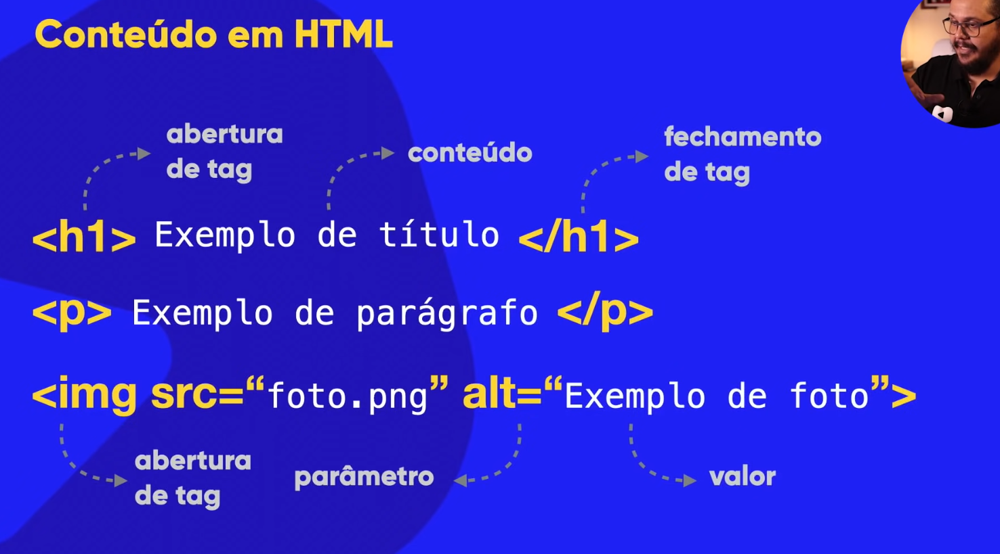
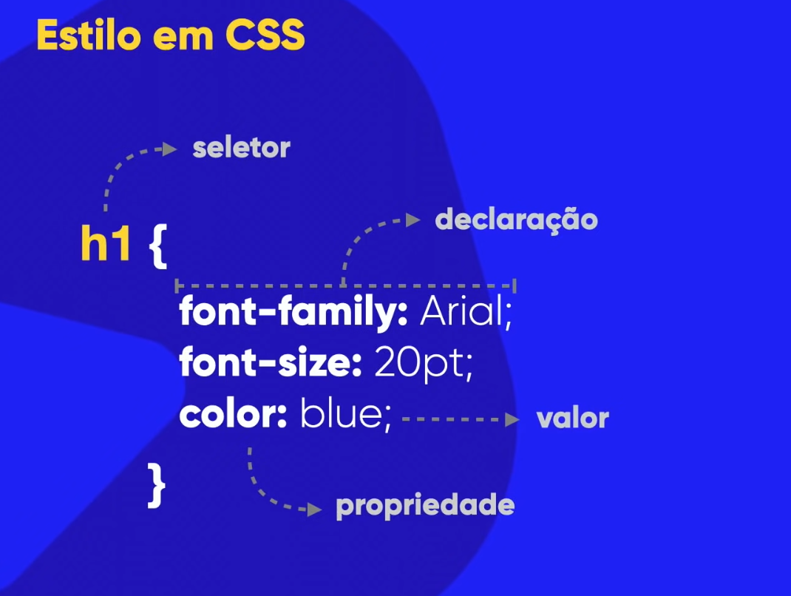

html e css não são linguagens de programação, 

"eu desenvolvo em html e css"  e não eu programo em html e css

html - hypertext markup language  (linguagem de marcação para hiper texto)

html não tem variaveis não é o mesmo que python por exemplo, ela é uma linguagem de marcação

css - cascading style sheets (folhas de estilo em cascata)

html é uma linguagem focada em conteúdo: textos; imagens; vídeos; tabelas e etc

css faz o design, cor, tamanho, posição, sombras

js é usada para cliques interativos para funções novas, python é mais backend, para database, api, IA e etc

----------------------------------------------------------------------

🐍 Python – IAs que você pode criar

Python é o padrão da indústria pra IA. Você pode fazer praticamente tudo:

IA de texto e linguagem → chatbots, tradutores, análise de sentimentos.

libs: transformers, nltk, spacy

IA de imagem → reconhecimento facial, detecção de objetos.

libs: opencv, tensorflow, pytorch

IA preditiva → prever vendas, preços, clima, etc.

libs: scikit-learn, xgboost

IA de voz → assistentes, reconhecimento de fala.

libs: speechrecognition, gtts

IA generativa → gerar textos, imagens, música.

libs: openai, diffusers, torch

💻 JavaScript – IAs que você pode usar

Mais voltado pro navegador (experiências interativas).

IA leve no browser → detectar rosto, gestos, som.

libs: TensorFlow.js, ml5.js

Chatbots simples → responder perguntas com lógica básica.

libs: botpress, rasa (com back-end Python)

IA integrada à web → usar APIs (como OpenAI, Hugging Face).

libs: axios, fetch pra chamar IA feita em Python ou serviços externos.

-----------------------------------------------------------------------

js: interações, menus, animações, popups

instalar extenção web developer no chrome ou edge

para informar que vai desenvolver um site em html ao programa inicia-se assim (seria declararq ue o tipo do documento é html)

head é a area de configurações e body é corpo que é onde fica o site

meta charset utf8 é para definir ao sistema que qualquer caractere digitado será convertido em bytes binarios entendiveis pelos seu pc para condificar corretamente

a parte de mate name toda á para a pagina entender que será visualizada e aberta em padrão 100%

title é o que aparece no inicio da pagina que por padrão é Document

h1 foi uma linha criada e digitada olá mundo, caso abra em um servidor mostraria documento como titulo e uma linha no corpo digitado olá mundo

<!DOCTYPE html>

<html lang="pt-br">
    <head>
        <meta charset="UTF-8">
        <meta name="viewport"
        content="width=device-width,
        initial-scale=1.0">
        <title>Document</title>
    </head>
    <body>
        <h1>Olá, mundo!</h1>
    </body>
</html>

-----------------------------------------------------------------------

pesquisar sobre seo

SEO = Search Engine Optimization
(Em português: Otimização para Mecanismos de Busca)

É um conjunto de técnicas para fazer um site aparecer melhor no Google:

Principais pontos:

Palavras-chave certas no conteúdo

Título e descrição bem escritos

Site rápido e adaptado para celular

Links de outros sites apontando para o seu (autoridade)

Conteúdo útil e bem estruturado

Objetivo: quando alguém pesquisar algo no Google, seu site aparecer nas primeiras posições — mais visitas, mais clientes.

Você também pode acessar o meu <a href="https://www.linkedin.com/in/luan-miguel-de-freitas-vieira-60a1a530b/" target="_blank">linkedin</a>

rel="noopener" → bloqueia acesso à aba original (segurança)

rel="noreferrer" → não envia o endereço de origem

o ideal seria 

Você também pode acessar o meu <a href="https://www.linkedin.com/in/luan-miguel-de-freitas-vieira-60a1a530b/" target="_blank" rel="noopener noreferrer">linkedin</a>

control + espaço escolhe uma das opções de arquivos na pasta

rel="nofollow"   para seu mecanismo de busca não anexar interesses com esse link

-----------------------------------------------------------------------

