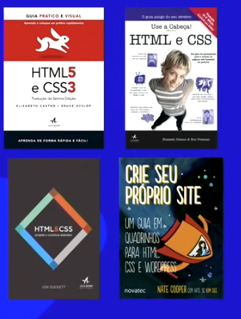
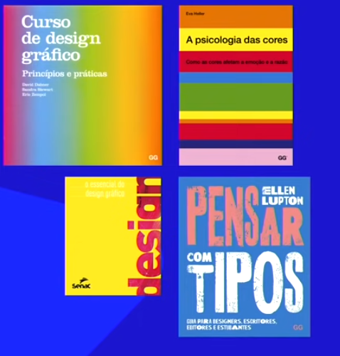
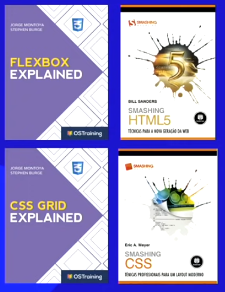

# playlist: https://www.youtube.com/watch?v=Ejkb_YpuHWs&list=PLHz_AreHm4dkZ9-atkcmcBaMZdmLHft8n

HTML5 E CSS3

html escreve, css faz a beleza

https://gustavoguanabara.github.io/

https://github.com/gustavoguanabara/html-css

* bibliografia recomendada:
    - Mozilla Developer Network
    - World Wide Web Consortium
    - WHATWG Living Standard
    - W3Schools

* Livros 
    -   (provavelmente existe as versões em pt-br)
    - 
    - 
    - 

    

