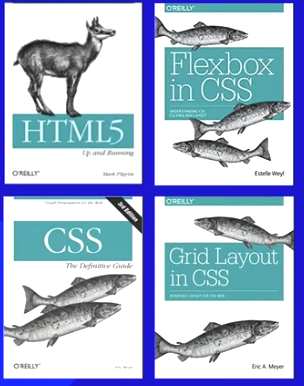
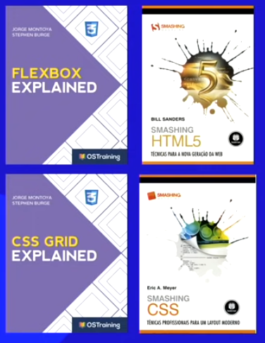
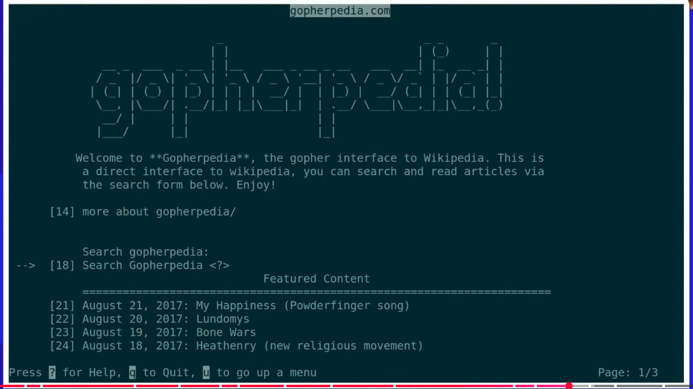
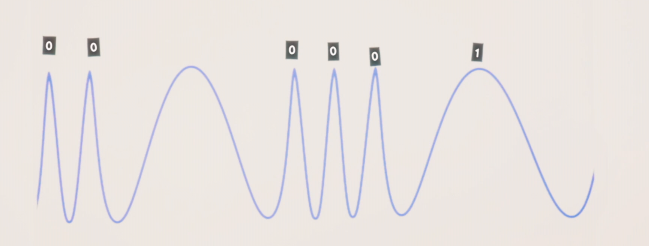

# playlist: https://www.youtube.com/watch?v=Ejkb_YpuHWs&list=PLHz_AreHm4dkZ9-atkcmcBaMZdmLHft8n

HTML5 E CSS3

html escreve, css faz a beleza

https://gustavoguanabara.github.io/

https://github.com/gustavoguanabara/html-css

* bibliografia recomendada:
    - Mozilla Developer Network
    - World Wide Web Consortium
    - WHATWG Living Standard
    - W3Schools

* Livros 
    -   (provavelmente existe as versões em pt-br)
    - 
    - 
    - 

    origem da internet veio da arpanet para proteger centros militares na guerra fria em 1977
    submarinecablemap.com
existem cabos submesos por todo o mundo para ligar a internet

também possuimos satélites e balões para ajudar na transmissão de áreas mais longe dos mares

para receber uma imagem de outro servidor, você solicita ela, ele quebra a imagem em varios pedacinho e envia, quando chega o seu pc só remonta tudo

https://www.youtube.com/watch?v=TNQsmPf24go   -documentario de how does the internet work

Gopher inicio da internet, não tinha mouse era apenas selecionando as coisas e dando comandos

  gopherpedia, você não tinha imagens, ali, tinha que baixar ela e abrir no seu pc

só em 1993 que mudou, até lá era assim a internet

Tim bernels lee criador do http:// e do html o http:// é do html 

www é world wide web, rede de alcance mundial

nele são usados navegadores, chrome, edge, opera

marc andreessen criou o primeiro navegador da internet 

dentro da internet existe o http, o ftp para transferencia de arquivos, o smtp, pop3 e imap para envio e recebimento de e-mails, o gopher para usar por textos e setas 

o www é u ma parte do http 

1800 – Alessandro Volta inventou a pilha elétrica, criando a primeira fonte de corrente contínua.

em torno de 2150 provavelmente o carvão que é composto por 25% da energia global sera extinto.

petróleo provavelmente ficará extinto em 2075, sendo responsávedl por 35% da energia global.

gás natural em 2060, sendo responsável por 23% da energia global.

internet 2 a 3% do consumo de energia global.

Indústria	~54%
Transforma matéria-prima em produtos (ex.: minério em aço, trigo em farinha, petróleo em plástico).

Pode ser pesada (metalurgia, cimento, química) ou leve (alimentos, vestuário, eletrônicos).

Transporte	~28%
Pode ser rodoviário (carros, caminhões, ônibus), ferroviário (trens), aéreo (aviões), marítimo (navios) ou fluvial (barcos).
Inclui também logística e distribuição, que garantem que produtos cheguem ao destino.

Residencial e Comercial	~18%
casas e apartamentos; energia para iluminação, eletrodomésticos, aquecimento, refrigeração, cozinhar, carregar aparelhos.

Comercial: lojas, escritórios, escolas, hospitais; energia para iluminação, ar-condicionado, computadores, elevadores, equipamentos diversos.

gas natural

combustível fóssil formado há milhões de anos a partir de restos de plantas e animais enterrados e submetidos a pressão e calor no subsolo.

É principalmente metano (CH₄), mas também contém outros gases como etano, propano e butano.

Usado para gerar eletricidade, aquecimento, cozinhar e como combustível veicular.

É considerado mais limpo que carvão e petróleo, porque emite menos poluentes e CO₂ ao ser queimado.

solução, energia solar, isso provavelmente irá salvar o mundo, estamos sendo burros em utilizar energia limitadas e não investir suficiente em energias sustentáveis, como a solar que pode durar em tonro de 5bilhões de anos.

tenha painel solar e milite sobre isso, apenas 25 mil reais é o suficiente para um sistema completo, as empresas não querem que você instale porque as grandes companhias de energia lucram com isso

em um condominio médio, seria possível economizar cerca de 40% da energia total colocando placas solares aonde precisaria.

em um casa da pra deixar 100% da energia gratuita.

* o mundo não é movido por energia eolica unicamente porque as empresas querem lucrar com venda de petroleo, gas e carvão, daria para suprir 100% da energia global e não seriamos comprometido, é um recurso infinito * 

referencia artisita: o menino que descobriu o vento.

militar sobre energia eolica, muito melhor que a solar, e salvadora da energia global.

total em torno de 80% da energia global sendo consumida por recursos finitos, petróleo, gas natural e carvão.

tudo na internet é por codigo binario, então ele envia os 0 e 1 por ondas para outras torres

um celular é literalmente um rádio que transmite ondas de 0 e 1 para o roteador, seja do wi-fi ou do seu 4g para sua torre operadora

do roteador dependendo do cabo ele envia pulsos de laser ou da eletricidade para o data center da operadora

o laser a eletricidade envia por 0 e 1 também, seja um choque mais longo e um mais curto e vice-versa

quando falamos de fibra ótica estamos falando de cabos super finos de vidro assim passa luz em uma velocidade de 200mil kms por segundo (a velocidade da luz é 300 mil kms por segundo então é muito rapido)

para ter uma ideia, um carro chega até 200 kms por hora cabo faz isso em 0,002 segundos

sharks are not the enemies of the internet

o nome bit vem de binary digit zero e um onde o zero é desligado e 1 ligado, 

8 bits = 1 byte     1 byte é uma sequencia de 8 bits    um byte é uma porção mínima que pode representar uma informação

o computador fala em uma lingua binaria chamada utf-8 que é um multibyte  juntando os 8 bites
exemplo: 01000001 = A

que é diferente do morse

1024 bytes = 1kb (1 kilo bytes)

1024 kb = 1 mb (1 mega byte)

1024 mg = 1 gb(1 giga byte)
1024 gb = 1 tb (1 tera byte)
1024 tb = 1 pb (1 peta byte)
1024 pb = 1 eb (1 exa byte)
1024 eb = 1 zb (1 zetta byte)
1024 zb = 1 yb (1 yotta byte)

MB != Mb

(!= significa diferente em python)

MB = Comprei um SSD de 1TB  (Terabyte) (Um tera)

Mb = Minha internet são 100 Mb (Megabites)  (ou 100 mega)

https://www.iplocation.net/

o nome modem vem de modulação e demodulação, que é pegar as ondas quadradas de pc e mais redondas que é a que vem da data center

quando você desliga um servidor e liga de novo ele ja muda o ip, isso é para todos os ips

servidor dns domain name system 

exemplo: instagram.com  isso é um dominio

então você faz um dominio como se fosse um nome salvo para aquela empresa e o ip que sempre muda apenas fica vinculado a esse dominio sempre

toda vez que você acessa um dominio o sistema verifica o ip atual e conecta você a ele por esse dominio

do seu roteador até o servidor

quando tem https:// seria o protocolo

quando tem o s é de segurança aparece o cadeado ao lado

tld - total level domain     ultima parte depois do ponto   google.com o tld é .com

gov.br tld é .br

Genéricos (gTLDs): .com, .org, .net, .info

de país (ccTLDs): .br (Brasil), .us (EUA), .jp (Japão)

